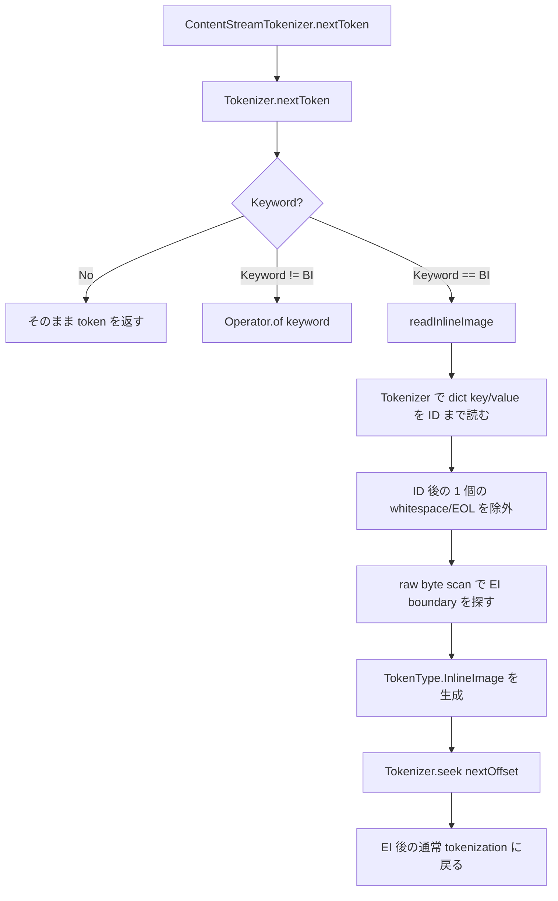

# Inline Image Tokenizer の実装

> **カテゴリ**: 実装ドキュメント
> **関連 spec**: [05_content_streams.md](../specs/05_content_streams.md) / ISO 32000-1:2008 §8.9.7 Inline Images
> **実装**: `packages/core/src/content-stream/tokenizer/`
> **ステータス**: Issue #134 で実装

## 概要

PDF content stream の inline image は、通常の content stream operator と異なり、次の特殊構文を持つ。

```pdf
BI
  /W 1 /H 1 /CS /RGB /BPC 8
ID
... binary image bytes ...
EI
```

`ID` 以降の画像データは任意の byte 列であり、通常の PDF lexical token として読んではならない。
そのため `ContentStreamTokenizer` は `BI` を検出した時点で inline image 専用処理へ切り替え、`BI ... ID <bytes> EI` 全体を 1 個の `TokenType.InlineImage` として返す。

## 追加された公開 token

`packages/core/src/pdf/types/token/index.ts` に以下を追加した。

```ts
export interface TokenInlineImageDictEntry {
  readonly key: TokenName;
  readonly value: ReadonlyArray<Token>;
}

export interface TokenInlineImage {
  type: TokenType.InlineImage;
  readonly dict: ReadonlyArray<TokenInlineImageDictEntry>;
  readonly data: Uint8Array;
  offset: ByteOffset;
}
```

辞書は `Map` ではなく key/value pair の配列で保持する。
inline image dictionary は重複 key や省略名を含み得るため、tokenizer 層では順序と元 token を失わずに保持し、意味解釈は後続の interpreter 層へ委ねる。
value は配列や辞書のような composite object を表せるよう、1 個以上の token sequence として保持する。

## 処理フロー



重要なのは、画像データ領域だけは `Tokenizer.nextToken()` に渡さない点。
低レベル tokenizer は先頭で whitespace/comment を skip するため、画像データに使うと byte 列が壊れる。

## `readInlineImage` の役割

`packages/core/src/content-stream/tokenizer/inline-image.ts` の `readInlineImage` は、次の 3 段階で inline image を読む。

1. `readInlineImageDictionary`
   - `BI` 直後から `ID` までを通常 token として読む。
   - key は `TokenType.Name` のみ許可する。
   - value が配列 (`[...]`) や辞書 (`<<...>>`) の場合は、対応する閉じ token までを 1 個の value token sequence として読む。
   - value 欠損、`ID` 欠損、dict 内 `BI` は `CONTENT_STREAM_INLINE_IMAGE_INVALID` を返す。
2. `consumeDataPrefix`
   - `ID` 直後の LF / CR / CRLF / space など、1 個の whitespace/EOL marker を data から除外する。
   - 空白なしの `IDabc` 相当も扱う。
3. `findInlineImageEnd`
   - `Uint8Array` を raw scan し、boundary 条件を満たす `EI` を探す。
   - 見つかったら `data.subarray(afterIdOffset, dataEndExclusive)` で data を保持する。

## `Tokenizer.seek`

inline image を raw byte scan した後、低レベル tokenizer の現在位置を `EI` 直後へ同期する必要がある。
そのため `Tokenizer.seek(position): Option<PdfError>` を追加した。

```ts
seek(position: number): Option<PdfError>
```

範囲チェックは既存の `NumberEx.isSafeIntegerAtLeastZero` を使い、以下を不正とする。

- 負数
- 小数
- `NaN` / `Infinity`
- unsafe integer
- `data.length` を超える位置

成功時は `none`、失敗時は `TOKENIZER_POSITION_OUT_OF_RANGE` を `some(error)` で返す。
`Result<void, E>` は使わない。

## EI 終端判定

`EI` は画像 byte 内にも出現し得るため、単純な byte pattern search ではなく boundary 条件を置いている。
現実装で終端扱いするのは次の条件を満たす場合だけ。

| 条件 | 意味 |
|:---|:---|
| 候補位置が `E`, 次 byte が `I` | `EI` marker |
| `EI` の直前が PDF whitespace | data と marker の境界 |
| `EI` の直後が EOF / PDF whitespace / PDF delimiter | marker 後の token 境界 |

また、`EI` 直前の boundary whitespace は data から除外する。
直前が CRLF の場合は `\r\n` の両方を 1 個の EOL marker として除外する。

## 既知制約

PDF inline image の終端は仕様上あいまいで、画像 byte 内に ` EI ` や ` EI/` のような byte 列が現れる可能性がある。
完全な曖昧性解消には `/F` filter や画像長、decode 結果の解釈が必要になる。

Issue #134 の範囲では tokenizer 層の責務を次に限定している。

- inline image dictionary を token pair として読む。
- `ID` 以降を通常 tokenizer に読ませず raw byte として保持する。
- boundary 条件付きで `EI` を検出する。

filter/length を用いた完全な終端解決は、後続の image interpreter / decoder 層の設計対象とする。

## エラー契約

inline image の不正は `Result.err<PdfError>` で返す。

| ケース | code |
|:---|:---|
| `ID` 欠損 | `CONTENT_STREAM_INLINE_IMAGE_INVALID` |
| `EI` 欠損 | `CONTENT_STREAM_INLINE_IMAGE_INVALID` |
| dict key が `Name` でない | `CONTENT_STREAM_INLINE_IMAGE_INVALID` |
| dict value 欠損 | `CONTENT_STREAM_INLINE_IMAGE_INVALID` |
| dict 内で `BI` が出現 | `CONTENT_STREAM_INLINE_IMAGE_INVALID` |
| `Tokenizer.seek` の範囲外 position | `TOKENIZER_POSITION_OUT_OF_RANGE` |

## テスト観点

主なテストは `packages/core/src/content-stream/tokenizer/inline-image.test.ts` にある。

- inline image が 1 token として返る。
- dict key/value pair が順序保持される。
- `data` が `Uint8Array` として保持される。
- `offset` は `BI` の byte offset になる。
- `ID` 直後の LF / CR / CRLF / space / 空白なしを扱う。
- `abcEIdef` や `abc EI-like` を終端扱いしない。
- `EI` 後の次 token offset が正しく維持される。
- `ID` / `EI` 欠損、dict key/value 不正、nested `BI` が error になる。
- `EI` 直前 CRLF を data から除外する。

`Tokenizer.seek` は `packages/core/src/lexer/tokenizer/tokenizer.boundary.test.ts` で、正常移動、末尾 EOF、範囲外 error を確認している。

## 関連ファイル

- `packages/core/src/content-stream/tokenizer/index.ts`
- `packages/core/src/content-stream/tokenizer/inline-image.ts`
- `packages/core/src/lexer/tokenizer/index.ts`
- `packages/core/src/pdf/types/token/index.ts`
- `packages/core/src/pdf/errors/error/index.ts`
- `docs/specs/05_content_streams.md`
