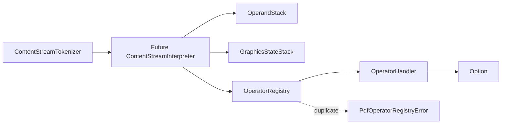

# OperatorRegistry 実装メモ

`OperatorRegistry` は PDF content stream の operator 名 (`m`, `BT`, `rg` など) から実行 handler を引くための小さな registry です。
後続の `ContentStreamInterpreter` が operator dispatch を集約するための拡張点として追加しています。

## 実装範囲

今回追加した主な実装は次の通りです。

- `packages/core/src/content-stream/operator-registry/index.ts`
  - `OperatorRegistry.create`
  - `OperatorRegistry.register`
  - `OperatorRegistry.lookup`
  - `OperatorRegistry.has`
  - `OperatorHandler`
- `packages/core/src/content-stream/graphics-state/stack.ts`
  - `GraphicsStateStack.create`
  - `GraphicsStateStack.current`
  - `GraphicsStateStack.replaceCurrent`
  - `GraphicsStateStack.save`
  - `GraphicsStateStack.restore`
- `packages/core/src/pdf/errors/error/index.ts`
  - `PdfOperatorRegistryError`
  - `PdfErrorCode` への `"OPERATOR_ALREADY_REGISTERED"` 追加
  - `PdfError` union への `PdfOperatorRegistryError` 追加

`OperatorRegistry` 本体は `@pdfmod/core` の root export には出していません。
現時点では content stream 内部の拡張点として扱い、root export は既存 error type と同様に `PdfOperatorRegistryError` のみ追加しています。

## OperatorRegistry の契約

`OperatorRegistry` は `Map<string, OperatorHandler>` を内部に持つ branded type です。
グローバル singleton ではなく `create()` で registry instance を生成するため、テスト間や interpreter instance 間で登録状態が共有されません。

```ts
export type OperatorHandler = (
  stack: OperandStack,
  state: GraphicsStateStack,
) => Option<PdfError>;
```

handler の戻り値は `Option<PdfError>` です。
成功時に値を返す必要がないため、`Result<void, PdfError>` ではなく「エラーがあれば `Some(error)`、なければ `None`」で表現します。

### register

`register(registry, name, handler)` は registry を mutate します。

- 未登録の operator 名なら handler を保存し、`None` を返す
- 同名 operator が登録済みなら `Some(PdfOperatorRegistryError)` を返す
- 重複登録時は既存 handler を上書きしない
- operator 名の妥当性検証は行わず、空文字も通常の `Map` key として扱う

重複登録エラーの構造は次の通りです。

```ts
{
  code: "OPERATOR_ALREADY_REGISTERED",
  message: `Operator is already registered: ${name}`,
  operatorName: name,
}
```

### lookup / has

`lookup(registry, name)` は登録済みなら `Some(OperatorHandler)`、未登録なら `None` を返します。
`has(registry, name)` は登録済み判定だけを `boolean` で返します。

## GraphicsStateStack の最小復旧

`OperatorHandler` は operand stack と graphics state stack を受け取る設計です。
local `main` に `GraphicsStateStack` の実装シンボルがなかったため、#133 相当の最小 API も同時に復旧しています。

`GraphicsStateStack` は現在状態 `current` と保存済み状態 `saved` を持ちます。

- `create()` はデフォルト `GraphicsState` を current に持つ stack を作る
- `save()` は current を LIFO stack に保存し、常に `None` を返す
- `restore()` は直近の saved state を current に戻し、常に `None` を返す
- saved state がない `restore()` は no-op として `None` を返す
- `replaceCurrent()` は current を明示的に差し替える

`GraphicsState` 型は `graphics-state.ts` に分離し、`graphics-state/index.ts` と `stack.ts` の循環依存を避けています。

## データフロー



## テストで保証している挙動

`packages/core/src/content-stream/operator-registry/index.test.ts` では次を検証しています。

- 作成直後の registry は未登録 operator を持たない
- `register` 後に `lookup` が同じ handler を `Some` で返す
- `register` 後に `has` が `true` を返す
- 異なる operator 名は独立して登録できる
- 同名 operator の重複登録は `OPERATOR_ALREADY_REGISTERED` を返す
- 重複登録後も既存 handler を保持する
- 空文字 operator 名は妥当性検証せず通常 key として登録する

`packages/core/src/content-stream/graphics-state/stack.basic.test.ts` では `save` / `restore` の LIFO 挙動、空 stack restore の no-op、`replaceCurrent` を検証しています。

error type 側では `PdfOperatorRegistryError` が `PdfError` union と root type export から扱えることを検証しています。

## 現時点の制約

- `OperatorRegistry` は handler の実行順や operand 数の検証を行わない
- operator 名の構文検証は行わない
- 未登録 operator を実行時エラーに変換する処理は未実装
- `ContentStreamInterpreter` 本体はまだ存在しないため、registry は dispatch 基盤のみを提供する

これらは後続フェーズで interpreter と個別 operator handler を追加するときに扱います。
