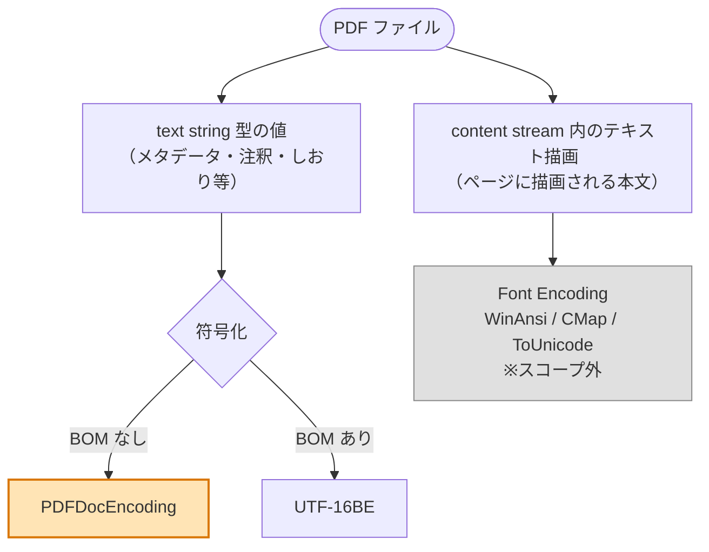
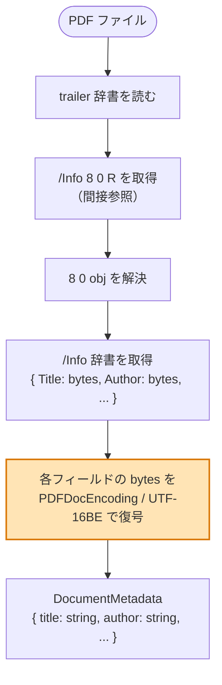

# PDFDocEncoding (ISO 32000-1 Annex D.2) 仕様メモ

PR #94 で実装した `packages/core/src/document/pdf-doc-encoding.ts` の対応仕様をまとめる。

## PDFDocEncoding の位置づけ — text string 全般の符号化

PDFDocEncoding は **PDF 全体の文字列 (text string) の汎用符号化方式** であり、`/Info` 専用ではない。ISO 32000-1 § 7.9.2.2 で「text string 型はすべて PDFDocEncoding か UTF-16BE で符号化される」と規定されている。

### text string が現れる主な場所

```
PDF 内で text string が現れる場所（一例）
├─ /Info 辞書          /Title /Author /Subject /Keywords /Creator /Producer
├─ /Catalog            /Lang （文書言語）
├─ ページ注釈           /Contents /T （Annotation）
├─ アウトライン         /Title （しおり項目名）
├─ フォーム             /TU /TM （フィールドのツールチップ等）
├─ 構造ツリー           /Alt /ActualText （アクセシビリティ）
└─ その他               text string 型と書かれた値はすべて
```

なお `/U` `/O` (暗号化辞書のパスワードハッシュ) や File ID は **byte string** 型で text string ではない。物理形式は同じ `(...)` `<...>` だが復号対象外。

### 適用範囲外 — content stream のテキスト描画

ページに描画される本文 (`BT ... ET` 内の `TJ` / `Tj` オペレータが扱うバイト列) は PDFDocEncoding ではなく、**フォントごとの Encoding** (WinAnsi / MacRoman / カスタム CMap / `/ToUnicode`) で復号する別世界の話。これは PR 2 のスコープ外。



オレンジが PR #94 (PR 2) の実装範囲。

## 判定の実態 — 何を見て PDFDocEncoding か UTF-16BE かを決めるか

PDF バイナリ内には「この文字列は PDFDocEncoding です」というフラグや encoding tag は **存在しない**。実装は以下の 2 段階で判定する。

### 段階 1 — 仕様書の表で「この値は text string 型か」を実装時に決め打ち

ISO 32000-1 の各セクション (例: § 14.3.3 Table 317 — Info Dictionary Entries) には、各キーの値の型 (text string / byte string / ASCII string / name / date / number 等) が表で規定されている。実装者はこの表を読み、`/Title` のコードでは `decodePdfString(...)` を呼び、`/Trapped` のコードでは PdfName として扱う、という形で**ハードコード**する。実行時にはここを「見る」処理は無い。

### 段階 2 — 実行時には文字列値の中身の先頭 2 バイトだけを見る

text string と分かっている値について、実行時にコードが見るのは **値のバイト列の先頭 2 バイトのみ** (BOM 検出)。

```
                /Title の値の bytes
              ┌────┬────┬────┬────┬─────
入力 bytes:   │ ?? │ ?? │ ?? │ ?? │ ...
              └────┴────┴────┴────┴─────
                ↑    ↑
                この 2 バイトだけ見て決める

  bytes[0] === 0xFE && bytes[1] === 0xFF
    ├─ true  → UTF-16BE で復号 (3 バイト目以降を 2 バイトずつ)
    └─ false → PDFDocEncoding で復号 (全バイトをテーブル参照)
```

つまり「BOM が事実上のフラグ」で、それ以外のメタデータ的な指示は PDF バイナリには無い。

### 階層の整理 — どこを見ているのか

```
8 0 obj                          ← オブジェクト全体（辞書）
<<                                
  /Title (Hello)                 
                ▲▲▲▲▲             
                これが「文字列値の中身」 = 5 バイト [48 65 6c 6c 6f]
                ↑ ↑
                この 2 バイトを見る  ← BOM チェックの対象（ASCII なので PDFDocEncoding 経路）

  /Author <FEFF65E597E5>         
           ▲▲▲▲▲▲▲▲▲▲▲▲          
           hex 表記をデコード = 6 バイト [FE FF 65 E5 97 E5]
           ↑   ↑
           この 2 バイトを見る  ← 0xFE 0xFF なので UTF-16BE 経路
>>
endobj
```

| 階層 | BOM チェックの対象? |
|---|---|
| `8 0 obj ... endobj` (オブジェクト境界) | × 違う |
| `<< ... >>` (辞書) | × 違う |
| `/Title (Hello)` (キー + 値ペア) | × 違う |
| `(Hello)` (リテラル全体、括弧含む) | × 違う |
| **`Hello` の生バイト列 (中身)** | **○ ここの先頭 2 バイト** |

辞書と文字列値を構文パースで切り出した**後**、その**中身のバイト列**の先頭 2 バイトを見る、という順序。1 つの辞書に複数の text string があっても、それぞれ独立に BOM 判定する。

### 対象オブジェクト型の絞り込み

PR 2 の復号が動くのは **`PdfString` 型のうち text string 型の値だけ**。物理形式が `(...)` `<...>` でも、用途が byte string や ASCII string のものは復号関数を呼ばない。

```
PDF オブジェクト型
├─ String (literal (..) / hex <..>)        ← 物理形式
│   ├─ text string         ★ PR 2 の対象（PDFDocEncoding/UTF-16BE 経路）
│   ├─ byte string         × 生バイトのまま (例: /U /O / File ID)
│   └─ ASCII string        × ASCII 確定 (復号不要)
├─ Name        (/Title /Catalog 等)         × ASCII + #エスケープのみ
├─ Number      (42, 3.14)                   ×
├─ Boolean     (true, false)                ×
├─ Null        (null)                       ×
├─ Array       ([1 2 3])                    × (要素ごとに判定)
├─ Dictionary  (<< /K /V >>)                × (値ごとに判定)
├─ Stream      (<< ... >> stream ... endstream)  × (中身は別の復号系統)
└─ Indirect Reference (8 0 R)               ×
```

ISO 32000-1 § 7.9.2 では String を 3 つのサブ型 (text / byte / ASCII) に分けており、どのサブ型として扱うかは**仕様書側で各キーごとに規定**されている。

## 直近の利用先 — `/Info` 辞書とメタデータ

PDFDocEncoding の汎用性を踏まえた上で、Issue #18 (`DocumentInfoParser`) における直近の利用先である `/Info` 辞書を例として示す。`/Info` は **辞書オブジェクト** で Title / Author / Producer / CreationDate などのメタデータが格納されている (ISO 32000-1 § 14.3.3 "Document Information Dictionary")。

### PDF ファイル構造の中の `/Info` の位置

```
┌─────────────────────────────────────────────┐
│ %PDF-1.7                            ← header│
├─────────────────────────────────────────────┤
│ 1 0 obj                                     │
│ << /Type /Catalog /Pages 2 0 R >>           │
│ endobj                                      │
│                                             │
│ 2 0 obj   (Pages tree)                      │
│ ...                                         │
│                                             │
│ 8 0 obj   ← /Info 辞書（メタデータ）        │
│ <<                                          │
│   /Title (Annual Report 2026)               │
│   /Author (Microsoft® Word)                 │
│   /Producer (Adobe Acrobat 24)              │
│   /CreationDate (D:20260425103000+09'00')   │
│   /Keywords (PDF, ISO 32000)                │
│   /Trapped /False                           │
│ >>                                          │
│ endobj                                      │
├─────────────────────────────────────────────┤
│ xref                              ← 索引     │
│ 0 9                                         │
│ 0000000000 65535 f                          │
│ ...                                         │
├─────────────────────────────────────────────┤
│ trailer                                     │
│ <<                                          │
│   /Size 9                                   │
│   /Root 1 0 R                               │
│   /Info 8 0 R     ← trailer から /Info を参照│
│ >>                                          │
│ startxref                                   │
│ 12345                                       │
│ %%EOF                                       │
└─────────────────────────────────────────────┘
```

### メタデータを取り出すまでの流れ



オレンジが今回の PR 2 でカバーした「bytes → string の復号テーブル」部分。

### 関連仕様

- ISO 32000-1 § 14.3.3 Document Information Dictionary — `/Info` の中身 (Title / Author / Subject / Keywords / Creator / Producer / CreationDate / ModDate / Trapped)
- § 7.5.5 File Trailer — trailer に `/Info` 参照が入る
- § 7.9.2 String Objects — 文字列の符号化 (PDFDocEncoding or UTF-16BE)
- § 7.9.4 Dates — `D:YYYYMMDDHHmmSSOHH'mm'` フォーマット

`/Info` は PDF 2.0 で deprecated (XMP メタデータ推奨) だが、互換性のため依然として多くの PDF に存在する。

---

## PDFDocEncoding テーブル全景 (256 entries)

```
byte    領域                                ISO 32000 仕様                          実装での対応
─────────────────────────────────────────────────────────────────────────────────────
0x00 ─┐
 ..   │  Control 文字 (素通し)              U+0000..U+0017                          そのまま代入
0x17 ─┘                                     (NUL, SOH, ..., ETB)
─────────────────────────────────────────────────────────────────────────────────────
0x18 ─┐
 ..   │  Diacritics (PDF 独自)              U+02D8 (˘), U+02C7 (ˇ), U+02C6 (ˆ),    DIACRITIC_CHARS で
0x1F ─┘                                     U+02D9 (˙), U+02DD (˝), U+02DB (˛),    上書き代入
                                            U+02DA (˚), U+02DC (˜)
─────────────────────────────────────────────────────────────────────────────────────
0x20 ─┐
 ..   │  ASCII 印字可能 (素通し)            U+0020..U+007E                          そのまま代入
0x7E  │                                     ' ', '!', ..., '~'
0x7F ─┘  DEL (素通し)                       U+007F
─────────────────────────────────────────────────────────────────────────────────────
0x80 ─┐
 ..   │  Special symbols (PDF 独自)         U+2022 (•), U+2020 (†), U+2021 (‡),    UPPER_SPECIAL_CHARS
 ..   │  (publishing 系記号)                U+2026 (…), U+2014 (—), U+2013 (–),    で上書き代入
 ..   │                                     ..., U+0152 (Œ), U+0160 (Š), ...,
0x9E ─┘                                     U+017E (ž)
─────────────────────────────────────────────────────────────────────────────────────
0x9F     未割当                             ─                                       undefined
─────────────────────────────────────────────────────────────────────────────────────
0xA0     Euro (PDF 独自)                    U+20AC (€)                              EURO_BYTE で代入
         (Latin-1 では NBSP の位置)
─────────────────────────────────────────────────────────────────────────────────────
0xA1 ─┐
 ..   │  Latin-1 supplement (素通し)        U+00A1 (¡), U+00A2 (¢), ...,           ループで代入
0xAC ─┘                                     U+00AC (¬)
─────────────────────────────────────────────────────────────────────────────────────
0xAD     未割当                             ─ (Latin-1 では SOFT HYPHEN)           undefined
─────────────────────────────────────────────────────────────────────────────────────
0xAE ─┐
 ..   │  Latin-1 supplement (素通し)        U+00AE (®), ..., U+00FF (ÿ)            ループで代入
0xFF ─┘
```

## 領域ごとの仕様詳細 (ISO 32000-1 Annex D.2)

PDFDocEncoding は **ほぼ Latin-1 (ISO 8859-1) と同じだが、4 つの差し替え領域と 2 つの未割当バイトを持つ拡張**。各領域の規定根拠を以下に整理する。

### 0x00..0x17 — C0 制御文字 (素通し)

ISO 32000-1 Annex D.2 で `Code` 列に値が無く、Latin-1 の C0 制御文字 (U+0000..U+0017: NUL, SOH, STX, ..., ETB) と同じコードポイントに変換する規定。テキスト処理ではほぼ使われないが、技術的には `\t` (0x09 HT), `\n` (0x0A LF), `\r` (0x0D CR) などが含まれる。

### 0x18..0x1F — ダイアクリティカル文字 (PDF 独自差し替え)

Latin-1 では C0 制御文字 (CAN, EM, SUB, ESC, FS, GS, RS, US) が並ぶ範囲だが、**PDF はこの 8 byte をタイポグラフィのアクセント記号に再割当**している。

| byte | 文字 | Unicode | 名称 |
|---|---|---|---|
| 0x18 | ˘ | U+02D8 | BREVE |
| 0x19 | ˇ | U+02C7 | CARON |
| 0x1A | ˆ | U+02C6 | MODIFIER LETTER CIRCUMFLEX ACCENT |
| 0x1B | ˙ | U+02D9 | DOT ABOVE |
| 0x1C | ˝ | U+02DD | DOUBLE ACUTE ACCENT |
| 0x1D | ˛ | U+02DB | OGONEK |
| 0x1E | ˚ | U+02DA | RING ABOVE |
| 0x1F | ˜ | U+02DC | SMALL TILDE |

PDF が出版・印刷向けの規格として欧州言語のアクセント記号を低コスト byte に詰め込んだ歴史的な経緯による。

### 0x20..0x7E — ASCII 印字可能 (素通し)

スペース ` ` (0x20) から `~` (0x7E) まで。完全に ASCII と一致。実用上の text string の大半 (`Title` / `Author` / 英文メタデータ) はこの範囲に収まる。

### 0x7F — DEL (素通し)

Latin-1 の DEL (U+007F) と同じ。Annex D.2 でも明示的に U+007F に対応。

### 0x80..0x9E — Publishing 系記号 (PDF 独自差し替え)

Latin-1 では C1 制御文字 (PAD, HOP, BPH, ...) の範囲だが、**PDF は publishing でよく使う記号 31 個に再割当**している。代表例:

| byte | 文字 | Unicode | 名称 |
|---|---|---|---|
| 0x80 | • | U+2022 | BULLET |
| 0x81 | † | U+2020 | DAGGER |
| 0x82 | ‡ | U+2021 | DOUBLE DAGGER |
| 0x83 | … | U+2026 | HORIZONTAL ELLIPSIS |
| 0x84 | — | U+2014 | EM DASH |
| 0x85 | – | U+2013 | EN DASH |
| 0x8D | " | U+201C | LEFT DOUBLE QUOTATION MARK |
| 0x8E | " | U+201D | RIGHT DOUBLE QUOTATION MARK |
| 0x96 | Π| U+0152 | LATIN CAPITAL LIGATURE OE |
| 0x97 | Š | U+0160 | LATIN CAPITAL LETTER S WITH CARON |
| 0x9C | œ | U+0153 | LATIN SMALL LIGATURE OE |
| 0x9E | ž | U+017E | LATIN SMALL LETTER Z WITH CARON |

(全 31 文字は実装の `UPPER_SPECIAL_CHARS` 配列を参照)

### 0x9F — 未割当 (穴)

Annex D.2 で `Code` 列が空欄。本実装ではテーブルを `undefined` にし、復号時に U+FFFD に置換 + `STRING_DECODE_FAILED` 警告。

### 0xA0 — EURO SIGN (PDF 独自差し替え)

Latin-1 では NBSP (NO-BREAK SPACE, U+00A0) の位置だが、**PDF は € (U+20AC EURO SIGN) を割り当てる**。これは 1999 年のユーロ導入を受けた追加で、Adobe PDF Reference 1.4 で初めて加わった。

### 0xA1..0xAC — Latin-1 supplement (素通し)

`¡` (0xA1) から `¬` (0xAC) まで Latin-1 と完全一致 (`U+00A1..U+00AC`)。

### 0xAD — 未割当 (穴)

Latin-1 では SOFT HYPHEN (U+00AD) の位置だが、**PDF は割当を持たない**。Annex D.2 の `Code` 列が空欄。本実装は `undefined` 扱い → U+FFFD 置換。

### 0xAE..0xFF — Latin-1 supplement (素通し)

`®` (0xAE) から `ÿ` (0xFF) まで Latin-1 と完全一致 (`U+00AE..U+00FF`)。アクセント付きラテン文字 (À, Á, Â, ...) が含まれる。

## ポイント

### 1. 「ほぼ Latin-1」だが穴 2 つと 3 領域の差し替えがある

```
                Latin-1 (CP-1252)              PDFDocEncoding
                ─────────────────              ──────────────
  0x18..0x1F    制御文字                  →    ˘ ˇ ˆ ˙ ˝ ˛ ˚ ˜    [差し替え]
  0x80..0x9F    Windows 拡張記号          →    PDF 独自 + 0x9F 未割当 [差し替え+穴]
  0xA0          NBSP                      →    €                    [差し替え]
  0xAD          SOFT HYPHEN               →    ─                    [穴]
```

### 2. 未割当バイト (0x9F, 0xAD) の扱い


ISO 32000 は未割当時の挙動を厳密には規定していないが、本実装は情報を失わずに警告で通知する方針。`null` / `undefined` を返さず常に string にすることで上位の Date / Title 等の組み立て側を簡潔に保つ。

### 3. WinAnsi (CP-1252) との混同に注意

0x96 は WinAnsi では en dash だが PDFDocEncoding では Œ (OE 合字)。en dash は PDFDocEncoding では 0x85。Adobe / iText / ISO 仕様すべて 0x85 = en dash で一致する。実装計画 (`tasks-02-pdf-doc-encoding.md` §5.3) に WinAnsi との混同による例の誤りがあったが、本実装は ISO 仕様に揃えてある。

## 実用での出現頻度

`/Info` 辞書 (`Title` / `Author` / `Subject` / `Keywords` / `Creator` / `Producer`) や `/CreationDate` は ASCII 範囲 (0x20..0x7E) のみで書かれることがほとんど。ただし以下のケースで上位領域が出る。

- `Producer` に "Microsoft® Word" のような ® (0xAE)
- `Title` に — (em dash, 0x84) や … (ellipsis, 0x83) を含む英文タイトル
- ヨーロッパ言語のメタデータで Latin-1 領域

多言語 (日本語・中国語等) は UTF-16BE BOM 経由 (PR 3 で実装予定)。

## 仕様参照

- ISO 32000-1:2008 Annex D.2 Table D.2 "PDFDocEncoding character set"
- ISO 32000-2:2020 同 Annex D
- ISO 32000-1 § 14.3.3 Document Information Dictionary
- ISO 32000-1 § 7.5.5 File Trailer
- ISO 32000-1 § 7.9.2 String Objects
- ISO 32000-1 § 7.9.4 Dates
