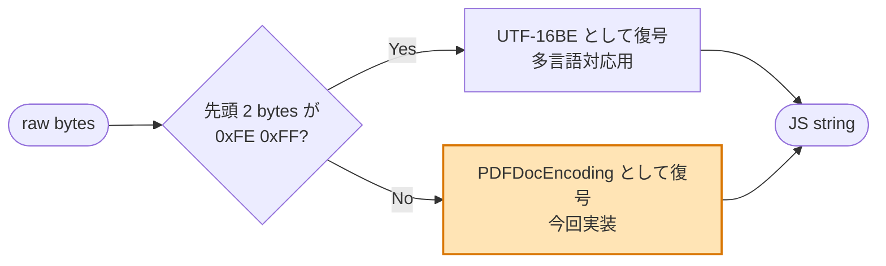
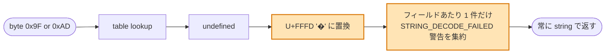

# PDFDocEncoding (ISO 32000-1 Annex D.2) 仕様メモ

PR #94 で実装した `packages/core/src/document/pdf-doc-encoding.ts` の対応仕様をまとめる。

## 全体像 — PDF 文字列の 2 系統復号

PDF の文字列 (`(Hello)` の literal や `<48656c6c6f>` の hex) は 2 つの符号化のどちらかで解釈される。



PR #94 (PR 2) は **PDFDocEncoding 経路の 1 バイト → Unicode 変換テーブル** を実装した部分。BOM 検出 / UTF-16BE 経路は PR 3 (`decode-pdf-string.ts`) で追加予定。

## PDFDocEncoding テーブル全景 (256 entries)

```
byte    領域                                ISO 32000 仕様                          実装での対応
─────────────────────────────────────────────────────────────────────────────────────
0x00 ─┐
 ..   │  Control 文字 (素通し)              U+0000..U+0017                          そのまま代入
0x17 ─┘                                     (NUL, SOH, ..., ETB)
─────────────────────────────────────────────────────────────────────────────────────
0x18 ─┐
 ..   │  Diacritics (PDF 独自)              U+02D8 (˘), U+02C7 (ˇ), U+02C6 (ˆ),    DIACRITIC_CHARS で
0x1F ─┘                                     U+02D9 (˙), U+02DD (˝), U+02DB (˛),    上書き代入
                                            U+02DA (˚), U+02DC (˜)
─────────────────────────────────────────────────────────────────────────────────────
0x20 ─┐
 ..   │  ASCII 印字可能 (素通し)            U+0020..U+007E                          そのまま代入
0x7E  │                                     ' ', '!', ..., '~'
0x7F ─┘  DEL (素通し)                       U+007F
─────────────────────────────────────────────────────────────────────────────────────
0x80 ─┐
 ..   │  Special symbols (PDF 独自)         U+2022 (•), U+2020 (†), U+2021 (‡),    UPPER_SPECIAL_CHARS
 ..   │  (publishing 系記号)                U+2026 (…), U+2014 (—), U+2013 (–),    で上書き代入
 ..   │                                     ..., U+0152 (Œ), U+0160 (Š), ...,
0x9E ─┘                                     U+017E (ž)
─────────────────────────────────────────────────────────────────────────────────────
0x9F     未割当                             ─                                       undefined
─────────────────────────────────────────────────────────────────────────────────────
0xA0     Euro (PDF 独自)                    U+20AC (€)                              EURO_BYTE で代入
         (Latin-1 では NBSP の位置)
─────────────────────────────────────────────────────────────────────────────────────
0xA1 ─┐
 ..   │  Latin-1 supplement (素通し)        U+00A1 (¡), U+00A2 (¢), ...,           ループで代入
0xAC ─┘                                     U+00AC (¬)
─────────────────────────────────────────────────────────────────────────────────────
0xAD     未割当                             ─ (Latin-1 では SOFT HYPHEN)           undefined
─────────────────────────────────────────────────────────────────────────────────────
0xAE ─┐
 ..   │  Latin-1 supplement (素通し)        U+00AE (®), ..., U+00FF (ÿ)            ループで代入
0xFF ─┘
```

## ポイント

### 1. 「ほぼ Latin-1」だが穴 2 つと 3 領域の差し替えがある

```
                Latin-1 (CP-1252)              PDFDocEncoding
                ─────────────────              ──────────────
  0x18..0x1F    制御文字                  →    ˘ ˇ ˆ ˙ ˝ ˛ ˚ ˜    [差し替え]
  0x80..0x9F    Windows 拡張記号          →    PDF 独自 + 0x9F 未割当 [差し替え+穴]
  0xA0          NBSP                      →    €                    [差し替え]
  0xAD          SOFT HYPHEN               →    ─                    [穴]
```

### 2. 未割当バイト (0x9F, 0xAD) の扱い



ISO 32000 は未割当時の挙動を厳密には規定していないが、本実装は情報を失わずに警告で通知する方針。`null` / `undefined` を返さず常に string にすることで上位の Date / Title 等の組み立て側を簡潔に保つ。

### 3. WinAnsi (CP-1252) との混同に注意

0x96 は WinAnsi では en dash だが PDFDocEncoding では Œ (OE 合字)。en dash は PDFDocEncoding では 0x85。Adobe / iText / ISO 仕様すべて 0x85 = en dash で一致する。実装計画 (`tasks-02-pdf-doc-encoding.md` §5.3) に WinAnsi との混同による例の誤りがあったが、本実装は ISO 仕様に揃えてある。

## 実用での出現頻度

`/Info` 辞書 (`Title` / `Author` / `Subject` / `Keywords` / `Creator` / `Producer`) や `/CreationDate` は ASCII 範囲 (0x20..0x7E) のみで書かれることがほとんど。ただし以下のケースで上位領域が出る。

- `Producer` に "Microsoft® Word" のような ® (0xAE)
- `Title` に — (em dash, 0x84) や … (ellipsis, 0x83) を含む英文タイトル
- ヨーロッパ言語のメタデータで Latin-1 領域

多言語 (日本語・中国語等) は UTF-16BE BOM 経由 (PR 3 で実装予定)。

## 仕様参照

- ISO 32000-1:2008 Annex D.2 Table D.2 "PDFDocEncoding character set"
- ISO 32000-2:2020 同 Annex D
- 関連: § 7.9.2 String Objects, § 7.9.4 Dates
